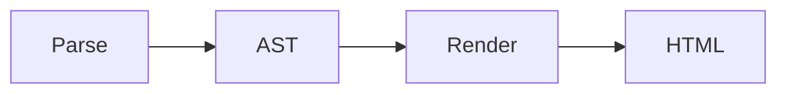

# H1

Lorem ipsum dolor sit amet, consectetur adipiscing elit. Morbi fermentum libero sed viverra ultricies.

## H2

Sed quis sem vel diam aliquam fermentum venenatis et eros. Sed vel cursus nisi, id vestibulum dolor.

### H3

Vestibulum eget lacus vitae velit laoreet sodales. Pellentesque habitant morbi tristique senectus et netus...

#### H4

Nullam elementum, neque sed placerat imperdiet, est magna posuere arcu, non semper eros neque a sapien.

##### H5

Maecenas nec mi velit. Ut lorem nisi, congue eu fringilla non, accumsan non nibh. Mauris elementum urna vel...

###### H6

Aenean consectetur quis est eu euismod. Proin faucibus elit sit amet lorem efficitur condimentum.

## Paragraphs & emphasis

Paragraphs are separated by one or more blank lines. A single newline within a paragraph does not create a line break — it's treated as a space.

This is a paragraph with **bold text**, *italic text*, and ***bold italic text***.

You can also use ~~strikethrough~~.

## Lists

An unordered list:

* Item A
* Item B
    * Nested item
    * Another nested item

An ordered list:

1. First
    * Nested item
    * Another nested item
2. Second
    1. Another first
    2. Another second

## Links & images

[A link to Wikipedia](https://www.wikipedia.org)

[A link to Wikipedia with title](https://www.wikipedia.org "This is the title")

A standard placeholder image:


A placeholder image with a title:


## Blockquotes

A simple blockquote:

> Lorem ipsum dolor sit amet, consectetur adipiscing elit. Morbi fermentum libero sed viverra ultricies. Etiam id orci ullamcorper, faucibus mauris nec, cursus enim. Morbi sed scelerisque erat. Pellentesque congue aliquam ante ac lobortis. Nulla ut sagittis ante. Pellentesque vitae facilisis velit. Fusce cursus magna sit amet diam bibendum, id mattis nunc pellentesque. Donec erat quam, interdum ac vestibulum non, interdum eu magna.

A nested blockquote:

> Lorem ipsum dolor sit amet, consectetur adipiscing elit. Morbi fermentum libero sed viverra ultricies.
>
> > Sed quis sem vel diam aliquam fermentum venenatis et eros. Sed vel cursus nisi, id vestibulum dolor.

## Code

### Inline code

Use `var x = 10;`

### Code block

A C# code block:

```csharp
public class HelloMarkdown
{
    public static void Main()
    {
        Console.WriteLine("Hello Markdown!");
    }
}
```

An indented code block:

    var x = 42;
    Console.WriteLine(x);

## Tables

| Name  | Age | City   |
|:----- |:--- |:------ |
| Alice | 30  | Paris  |
| Bob   | 25  | London |

## Task lists

Using an unordered list:

* [x] Completed task
* [ ] Pending task
* [ ] Another task

Using an ordered list:

1. [x] Completed task
2. [ ] Pending task
3. [ ] Another task

## Footnotes

Here is a sentence with a footnote.[^1]

[^1]: And here is the footnote of the above sentence.

## Abbreviations

The HTML specification is useful.

*[HTML]: HyperText Markup Language

## Auto links

<https://github.com/lunet-io/markdig>

## Reference links

[First link][ref]

[Second link][ref]

[ref]: https://www.wikipedia.org "Wikipedia"

## Fenced containers

::: warning
This is a warning container. You can put **any Markdown** content here.

- Including lists
- And other blocks
:::

## Alert blocks

> [!NOTE]
> Useful information that users should know, even when skimming content.

> [!TIP]
> Helpful advice for doing things better or more easily.

> [!IMPORTANT]
> Key information users need to know to achieve their goal.

> [!WARNING]
> Urgent info that needs immediate user attention to avoid problems.

> [!CAUTION]
> Advises about risks or negative outcomes of certain actions.

## Math

### Inline math

The quadratic formula is $x = \frac{-b \pm \sqrt{b^2 - 4ac}}{2a}$.

### Block math

$$
\int_0^\infty e^{-x^2} dx = \frac{\sqrt{\pi}}{2}
$$

## Diagrams

